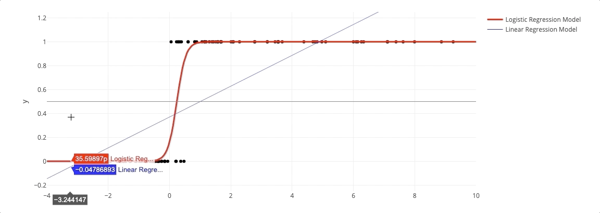
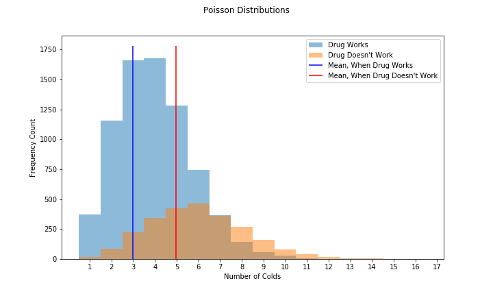

## Review and Demo Topics in Data Science
Jupyter notebooks that combine code, visualizations, and examples.

Content so far:

### Statistics
- Probability Problems
- Hypothesis testing
- Statistical power calculations
- Linear Regression and Logistic Regression

### Data Manipulation
- SQL and pandas comparison

### Machine Learning
- Gradient Descent