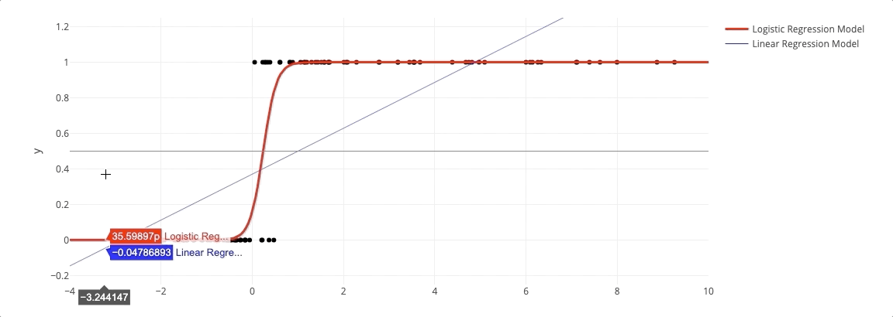

# Review and Demo Topics in Data Science
Jupyter notebooks and markdown files that cover various topics in Data Science

<!-- 
 -->
## Contents

#### Probability and Statistics
- Probability problems
- Hypothesis testing
- Statistical power calculations
- Linear regression and logistic regression

#### Machine Learning
- ML Algorithm descriptions
- Gradient descent and gradient boosting notebook
- Machine learning quiz

#### Data Engineering
- SQL example notebooks
- MongoDB example notebooks
- Scala example notebooks

#### Programming
- Data Structures and Algorithms
- Command line and Linux reference docs
- Docker, Kubernetes, and RedHat OpenShift reference docs
- Python cheatsheet

#### Misc
- Data Science Methodologies
