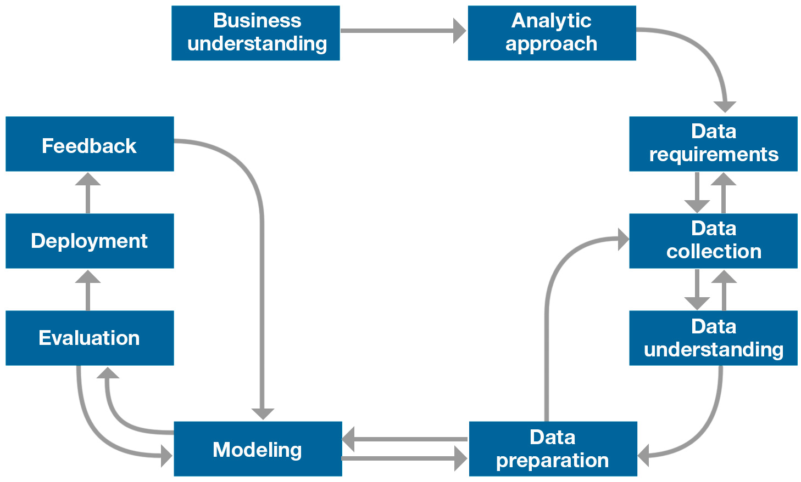

# Data Science Methodologies

## Cross-Industry Process for Data Mining
CRISP-DM methodology is a process aimed at increasing the use of data mining over a wide variety of business applications and industries. The intent is to take case specific scenarios and general behaviors to make them domain neutral.  CRISP-DM is comprised of six steps with an entity that has to implement in order to have a reasonable chance of success. The six steps are shown in the following diagram:

1. **Business Understanding** This stage is the most important because this is where the intention of the project is outlined. Foundational Methodology and CRISP-DM are aligned here. It requires communication and clarity. The difficulty here is that stakeholders have different objectives, biases, and modalities of relating information. They don’t all see the same things or in the same manner. Without clear, concise, and complete perspective of what the project goals are resources will be needlessly expended. 
2. **Data Understanding** Data understanding relies on business understanding. Data is collected at this stage of the process. The understanding of what the business wants and needs will determine what data is collected, from what sources, and by what methods. CRISP-DM combines the stages of Data Requirements, Data Collection, and Data Understanding from the Foundational Methodology outline. 
3. **Data Preparation** Once the data has been collected, it must be transformed into a useable subset unless it is determined that more data is needed. Once a dataset is chosen, it must then be checked for questionable, missing, or ambiguous cases. Data Preparation is common to CRISP-DM and Foundational Methodology. 
4. **Modeling** Once prepared for use, the data must be expressed through whatever appropriate models, give meaningful insights, and hopefully new knowledge. This is the purpose of data mining: to create knowledge information that has meaning and utility. The use of models reveals patterns and structures within the data that provide insight into the features of interest. Models are selected on a portion of the data and adjustments are made if necessary. Model selection is an art and science. Both Foundational Methodology and CRISP-DM are required for the subsequent stage. 
5. **Evaluation** The selected model must be tested. This is usually done by having a pre-selected test, set to run the trained model on. This will allow you to see the effectiveness of the model on a set it sees as new. Results from this are used to determine efficacy of the model and foreshadows its role in the next and final stage. 
6. **Deployment** In the deployment step, the model is used on new data outside of the scope of the dataset and by new stakeholders. The new interactions at this phase might reveal the new variables and needs for the dataset and model. These new challenges could initiate revision of either business needs and actions, or the model and data, or both.
CRISP-DM is a highly flexible and cyclical model. Flexibility is required at each step along with communication to keep the project on track. At any of the six stages, it may be necessary to revisit an earlier stage and make changes.

## Elaborated Data Science Methodology
(Courtesy of John B. Rollins, Ph.D. [Slides](https://www.slideshare.net/JohnBRollinsPhD/foundational-methodology-for-data-science), [Blog](https://web.archive.org/web/20200414234519/https://www.ibmbigdatahub.com/blog/why-we-need-methodology-data-science))


1. **Business understanding** The project sponsor and key stakeholders must define the problem/goal in business terms. This is often the most difficult step.
1. **Analytic approach**  The data scientist then needs to express the problem in the context of statistical and machine learning techniques.
1. **Data requirements** The analytic approach determines the data requirements, in terms of content, format, and representation.
1. **Data collection** The data must be aquired according to the requirements. Gaps must be documented, and these may require revisions to the data requirements or further data gathering.
1. **Data understanding** The data scientist then uses descriptive statistics and visualization to assess the content and quality of the data and provide initial insights. More data understanding may require the data scientist to collect more data.
1. **Data preparation** The data scientist then must use the data to construct a model-ready dataset. This could involve addressing missing/invalid values and duplicates. Feature engineering is the process of using domain knowledge of the data to create features. This is a very time-consuming step, and often takes about 70% of the overall project time. Automating this can therefore yield big rewards.
1. **Modeling** After the dataset is model-ready, it can be used to build analytic modles--descriptive or prescriptive. This is also a highly iterative stage and can involve experimenting with different algorithms and subsets of features.
1. **Evaluation** Evaluation allows the quality of the model to be assessed but it's also an opportunity
to see if it fully addresses the business need. Doing so requires the computing of various diagnostic measures—as well as other outputs, such as tables and graphs—using a testing set for a predictive model.
1. **Deployment**
While a data science model will provide an answer, the key to making the answer relevant and useful to address the initial question, involves getting the stakeholders familiar with the tool produced. In a business scenario, stakeholders have different specialties that will help make this happen, such as the solution owner, marketing, application developers, and IT administration.
1. **Feedback** By collecting results from the implemented model, the organization gets feedback on the model’s performance and observes how it affects its deployment environment. Analyzing this feedback enables the data scientist to refine the model, increasing its accuracy and thus its usefulness. This often overlooked stage can yield substantial additional benefits if undertaken as part of the overall process.
